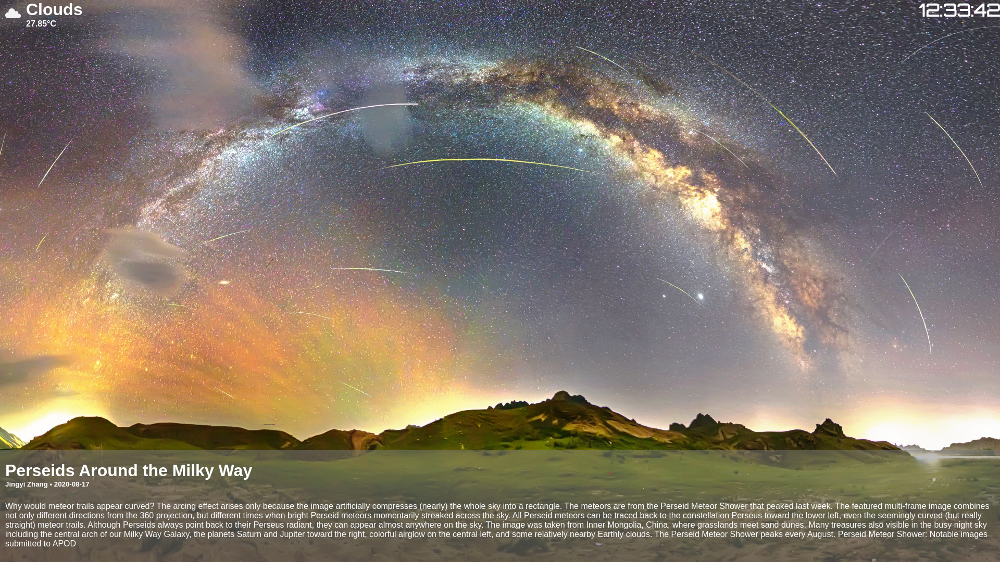

# Rustic Display



A display showing the NASA image of the day along with the description, date and title. It also uses OpenWeatherMap for weather information.\
I know the code is bad, I'm not a javascript programmer.

## Requirements:

- [NodeJS](https://nodejs.org/)
- [NASA API key](https://api.nasa.gov/)
- [OpenWeatherMap API key](https://openweathermap.org/)

## Installation:

```bash
# Clone the repository:
git clone https://github.com/Exitedsloth01/Rustic-Display

# Move into the directory:
cd Rustic-Display

# Install dependencies:
npm install

# Start the app:
npm start
```
